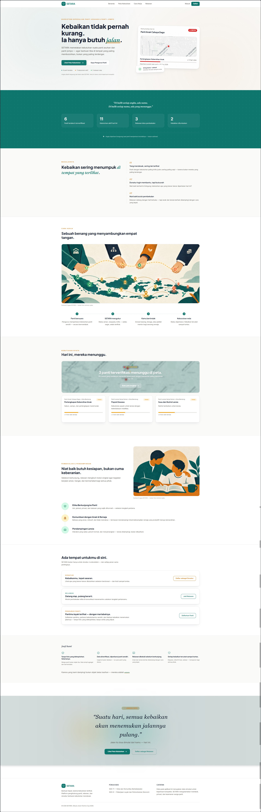
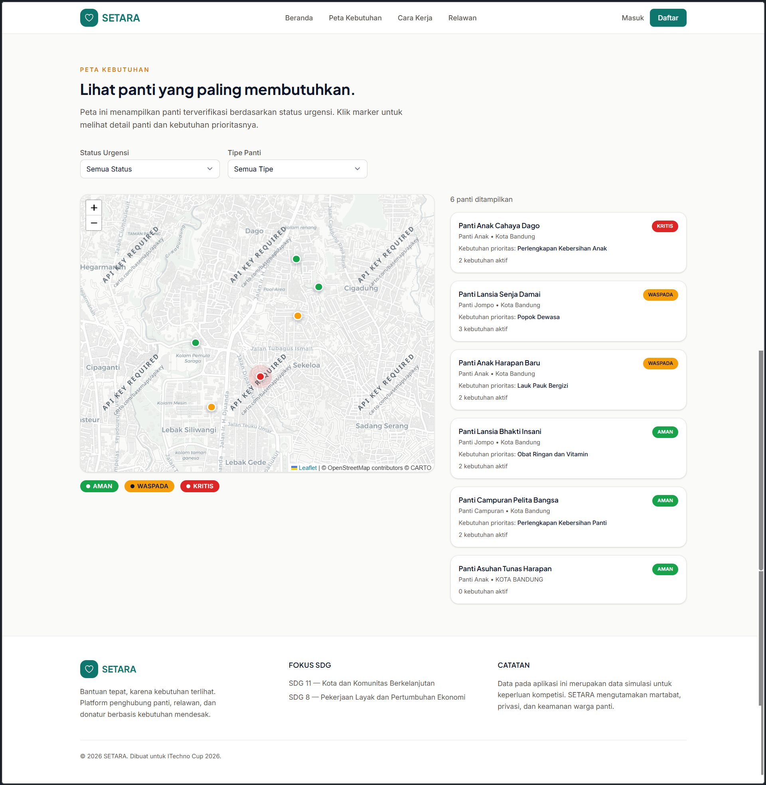
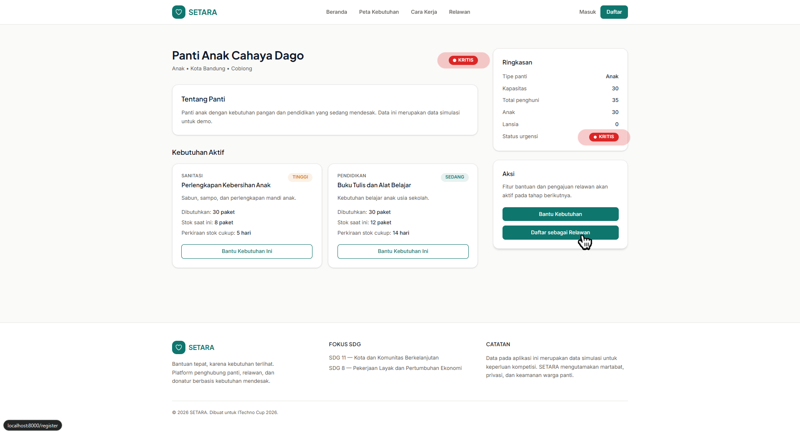
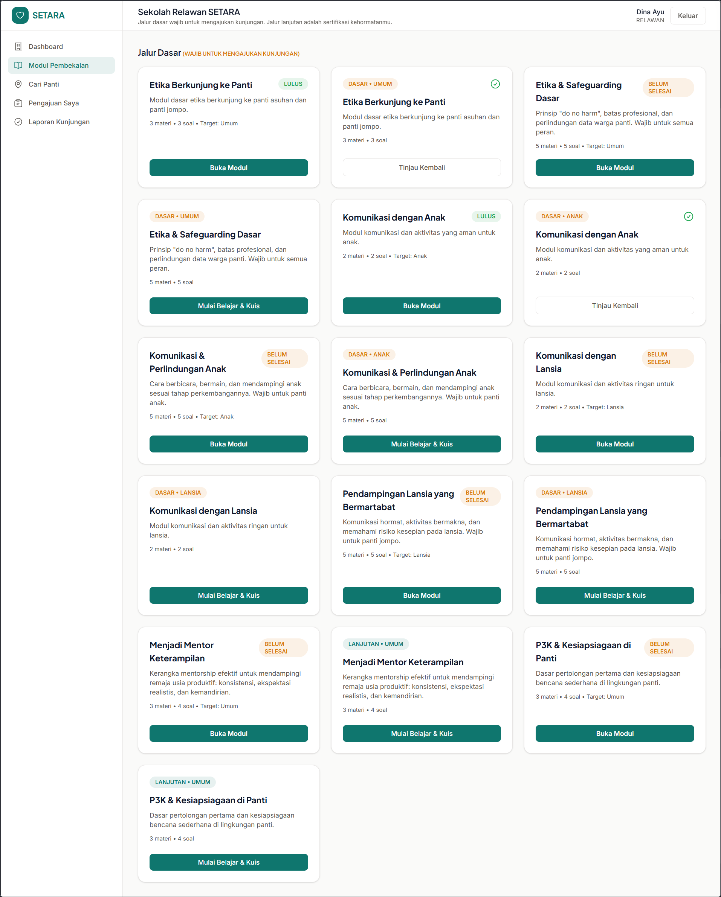
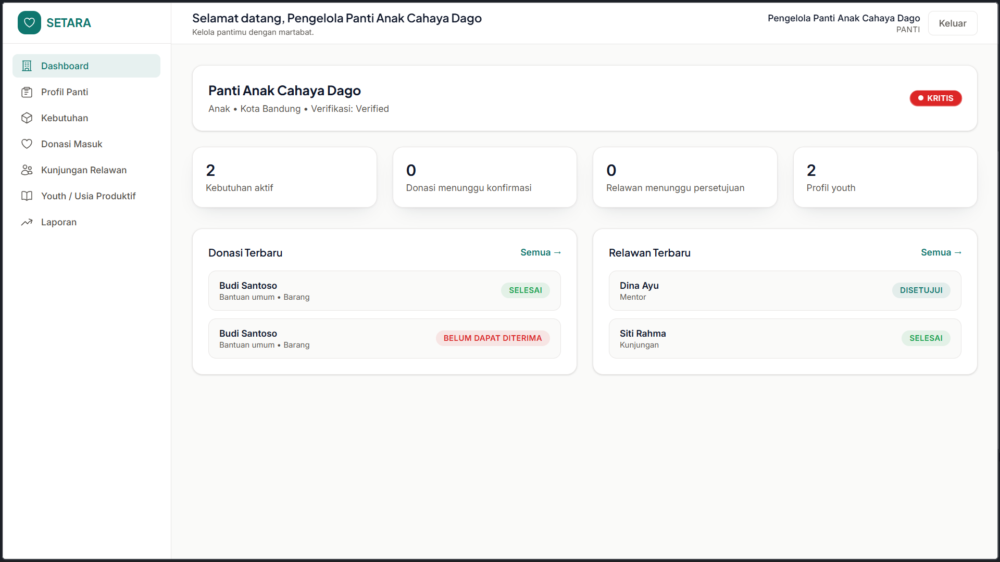
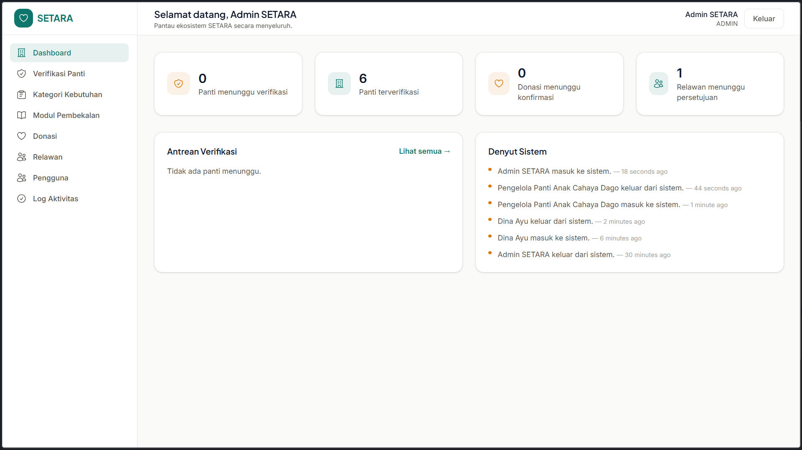
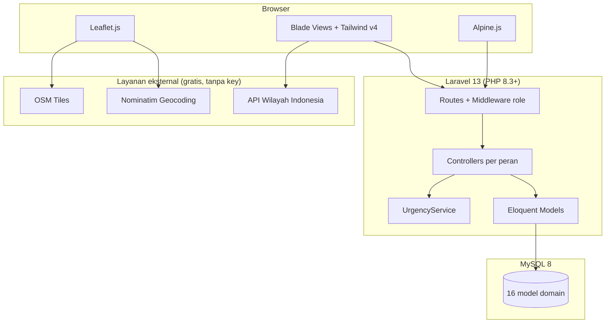
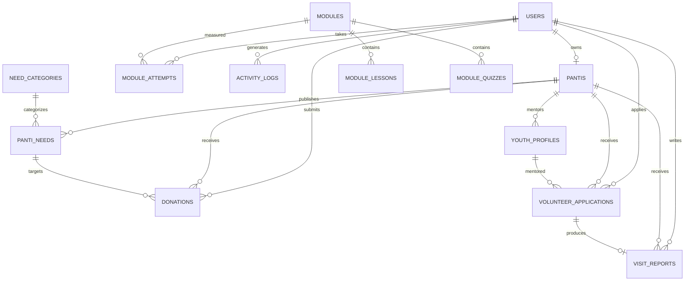

<div align="center">

# SETARA
### Bantuan tepat, karena kebutuhan terlihat.

[](https://setara-production-0557.up.railway.app/https://setara-production-0557.up.railway.app/)
[](https://github.com/sanjanimo/setara)
[](LICENSE)

**Submission for ITECHNO CUP 2026 — Web Development**

**By DakDikDuk • Politeknik Manufaktur Bandung**


</div>

> **Catatan:** Data panti, kebutuhan, dan pengguna pada demo ini merupakan **data simulasi** untuk keperluan kompetisi. Tidak merujuk pada individu atau institusi nyata.

---

## 📋 Daftar Isi

- [Tentang Proyek](#-tentang-proyek)
- [Fitur Unggulan](#-fitur-unggulan)
- [Cara Kerja Urgency Score](#-cara-kerja-urgency-score)
- [Etika, Privasi & Transparansi](#-etika-privasi--transparansi) 
- [Demo & Screenshot](#-demo--screenshot)
- [Teknologi](#-teknologi)
- [Arsitektur Sistem](#-arsitektur-sistem)
- [Instalasi & Setup](#-instalasi--setup)
- [Penggunaan](#-penggunaan)
- [API Documentation](#-api-documentation)
- [Testing](#-testing)
- [Tim Developer](#-tim-developer)
- [Lisensi](#-lisensi)

---

## 👥 Tim Developer

| Nama | Peran | GitHub |
| --- | --- | --- |
| Muhammad Huwaiza Rafi | Project Lead, QA, & Backend Developer | [@HuwaizaRafi25](https://github.com/HuwaizaRafi25) |
| Hafzi Hammadi Rafsanjani | Frontend Developer & Documentation | [@sanjanimo](https://github.com/sanjanimo) |
| Mochammad Faishal Ghani Iskandar | UI/UX Designer & Content | [@Faishalghn1](https://github.com/Faishalghn1) |


---

## 🎯 Tentang Proyek

### Latar Belakang

Kebaikan di Indonesia tidak pernah kurang — ia hanya sering **salah arah**. Bantuan menumpuk di panti yang populer, sementara panti dengan kebutuhan mendesak justru tak terlihat. Donatur ingin membantu tetapi tidak tahu apa yang benar-benar dibutuhkan; relawan datang dengan niat baik namun tanpa pembekalan; dan sebagian praktik kunjungan — tanpa sadar — mengeksploitasi gambar serta cerita warga panti demi rasa iba.

SETARA lahir untuk menjawab itu, selaras dengan **SDG 11 (Kota & Komunitas Berkelanjutan)** dan **SDG 8 (Pekerjaan Layak & Pertumbuhan Ekonomi)**: sebuah ekosistem yang membuat **kebutuhan terlihat**, sehingga bantuan — barang, tenaga, maupun pendampingan — tiba di tempat yang paling membutuhkan, dengan martabat dan transparansi.

### Fokus SDG

| Fokus | SDG | Alasan |
| --- | --- | --- |
| **Utama** | SDG 11 — Kota & Komunitas Berkelanjutan | Membangun komunitas inklusif, memperkuat jaringan panti-relawan-donatur, dan mendistribusikan bantuan lebih merata berbasis data. |
| **Pendukung** | SDG 8 — Pekerjaan Layak & Pertumbuhan Ekonomi | Modul kemandirian anak usia produktif menyiapkan keterampilan dan pendampingan mentor menuju kesiapan kerja. |

SETARA sengaja **tidak** mengklaim banyak SDG sekaligus agar solusi tetap fokus dan terukur.

### Solusi yang Ditawarkan

SETARA membalik logika platform donasi konvensional: **bukan panti yang mengejar perhatian, melainkan kebutuhan yang memanggil bantuan**. Panti memperbarui kondisinya sendiri; sistem mengukur urgensi (aman / waspada / kritis) dan menampilkannya sebagai **peta kebutuhan hidup** dengan pin berdenyut; donatur dan relawan diarahkan ke titik paling mendesak. Relawan wajib lulus modul basic yang relevan sebelum pengajuan kunjungan diproses — karena niat baik butuh kesiapan, bukan cuma keberanian.

### Tujuan Proyek

- 🎯 **Tujuan Utama**: Pemerataan penyaluran bantuan berbasis kebutuhan nyata, bukan popularitas.
- 📊 **Target Pengguna**: Pengurus panti asuhan/jompo, donatur, relawan, dan admin pengelola ekosistem.
- 💡 **Value Proposition**: Urgency scoring transparan + gatekeeping relawan + etika by-design (tanpa eksploitasi gambar, data youth anonim, diksi bermartabat).

---

## ✨ Fitur Unggulan

### Fitur Utama

| Fitur | Deskripsi | Keunggulan |
| --- | --- | --- |
| **Peta Kebutuhan Hidup** | Peta Leaflet dengan pin urgensi; pin merah *berdenyut* untuk panti kritis, filter status & tipe. | Kebutuhan "berbicara" secara visual; donatur melihat urgensi, bukan popularitas. |
| **Urgency Scoring Engine** | Skor 0–100 dari stok kebutuhan, okupansi, tipe panti sebagai proxy kerentanan, dan kesegaran data — lihat [penjelasan lengkap](#-cara-kerja-urgency-score). | Objektif, transparan, dan dihitung ulang ketika data panti atau kebutuhan diperbarui. |
| **Sekolah Relawan** | 3 modul basic + 5 modul advanced, kuis kelulusan ≥ 80, dan gatekeeping pengajuan berdasarkan target panti. | Relawan tiba dalam keadaan siap; perlindungan anak & lansia jadi fitur, bukan slogan. |
| **Manajemen Panti Mandiri** | Profil mandiri, CRUD kebutuhan generik, peta picker lokasi, donasi masuk, persetujuan relawan, youth anonim. | Panti berdaulat atas datanya sendiri — bermartabat. |
| **Pelacakan Niat Bantuan** | Donasi barang/tenaga berbasis kebutuhan: diajukan → dikonfirmasi → selesai, terlihat oleh donatur. | Kebaikan tercatat sampai tuntas; feedback loop tertutup. |
| **Panel Admin Bertaring** | Verifikasi berbasis halaman detail, CRUD modul + materi + kuis, monitor lintas panti, log aktivitas menyeluruh. | Kendali & audit penuh atas ekosistem. |

### Fitur Tambahan

- **Lokasi pintar** — dropdown berantai Provinsi → Kota → Kecamatan (API Wilayah Indonesia) + peta picker + pencarian alamat (Nominatim), lat/long terisi otomatis.
- **Diksi bermartabat** — "Belum Dapat Diterima" alih-alih "Ditolak"; tanpa foto eksploitasi; youth tampil sebagai inisial.
- **Design system khas** — palet Teal Forest & Warm Amber, motif *pulse ring*, *dashed thread*, dan grain kertas (lihat `docs/DESIGN.md`).
- **Activity log** — jejak audit setiap aksi penting (auth, verifikasi, donasi, modul, relawan).
- **Presisi lokasi publik** — panti memilih tampil "area umum" atau alamat detail.
- **Dashboard personal** per peran dengan progres, aksi cepat, dan aktivitas terbaru.

---

## 📈 Cara Kerja Urgency Score

Status urgensi panti **tidak ditentukan oleh popularitas**, melainkan dihitung dari 4 komponen terukur:

| Komponen | Bobot | Contoh Logika |
| --- | --- | --- |
| Kekurangan pasokan (stok) | 50% | Stok ≤ 3 hari → skor 100; stok > 14 hari → skor 10 |
| Beban kapasitas panti | 20% | Penghuni > kapasitas → skor 100; penghuni < 80% kapasitas → skor 20 |
| Kerentanan penghuni | 20% | Diproksikan dari tipe panti: jompo 80, campuran 70, anak 60, tipe lain 40 |
| Keterbaruan data | 10% | Update < 7 hari → skor 100; update > 30 hari → skor 10 |

```
urgency_score = 0.5 × supply_score
              + 0.2 × capacity_score
              + 0.2 × vulnerability_score
              + 0.1 × freshness_score
```

| Skor | Status | Warna Pin |
| --- | --- | --- |
| 0–39 | Aman | 🟢 Hijau |
| 40–69 | Waspada | 🟡 Kuning |
| 70–100 | Kritis | 🔴 Merah (berdenyut di peta) |

Perhitungan dilakukan oleh `App\Services\UrgencyService` ketika profil atau kebutuhan panti diperbarui. Komponen freshness menggunakan `updated_at` panti.

---

## 🤝 Etika, Privasi & Transparansi

SETARA dirancang dengan prinsip *privacy & ethics by design*, bukan sebagai tempelan:

- **Tanpa eksploitasi gambar** — tidak ada foto close-up wajah anak atau lansia untuk memancing rasa kasihan. Visual mengutamakan aktivitas, tangan, dan data kebutuhan.
- **Data youth anonim** — remaja usia produktif hanya ditampilkan sebagai inisial, usia, dan minat keterampilan; tanpa nama lengkap, foto, atau alamat.
- **Presisi lokasi opsional** — panti dapat memilih menampilkan alamat detail atau hanya "area umum" untuk melindungi keamanan penghuni.
- **Gatekeeping relawan** — endpoint pengajuan memeriksa modul basic yang wajib sesuai tipe panti sebelum menerima pengajuan.
- **Diksi bermartabat** — bahasa UI menghindari framing "mengasihani" (lihat contoh di [Fitur Tambahan](#-fitur-unggulan)).
- **AI (jika digunakan)** — rekomendasi bersifat rule-based dan dijelaskan sebagai mesin rekomendasi, bukan diklaim sebagai AI generatif, agar tidak menyesatkan dan tetap dapat dipertanggungjawabkan.

> *"SETARA tidak dibangun untuk menampilkan panti sebagai objek belas kasihan. SETARA dibangun agar kebutuhan terlihat, relawan siap, donatur tepat, dan panti dapat tumbuh secara bermartabat."*

---

## 📸 Demo & Screenshot

### Live Demo

🔗 **[Kunjungi Website](https://setara-production-0557.up.railway.app/)**

### Screenshot Aplikasi

<div align="center">

<p><em>Landing — "Kebaikan tidak pernah kurang. Ia hanya butuh jalan."</em></p>


<p><em>Peta Kebutuhan — pin merah berdenyut menandai yang paling mendesak.</em></p>


<p><em>Detail Panti — kebutuhan nyata dengan bar stok "± N hari tersisa".</em></p>


<p><em>Sekolah Relawan — jalur dasar wajib & jalur lanjutan sertifikasi.</em></p>


<p><em>Dashboard Panti — kelola kebutuhan, donasi, dan relawan.</em></p>


<p><em>Admin — tinjauan verifikasi berbasis data lengkap.</em></p>
</div>

### Video Demo

📹 **[Link Video Demo](https://ISI_URL_VIDEO)** _(opsional)_

---

## 🛠️ Teknologi

### Tech Stack

#### Frontend
```
Templating   : Laravel Blade (server-side rendering)
Styling      : Tailwind CSS v4 (design tokens via @theme)
Interaktivitas: Alpine.js
Animasi      : AOS (scroll reveal) + Lenis (smooth scrolling)
Peta         : Leaflet.js + CARTO basemap; OpenStreetMap/Nominatim untuk lokasi
Font         : Plus Jakarta Sans, Inter, Fraunces (aksen italic)
Build        : Vite
```

#### Backend
```
Runtime      : PHP 8.3+ (runtime lokal saat audit: PHP 8.5.10)
Framework    : Laravel 13.17+
Database     : MySQL 8.0 pada environment lokal; SQLite didukung oleh konfigurasi Laravel
ORM          : Eloquent
Auth         : Laravel Session Auth + middleware role custom
Validation   : FormRequest per fitur
```

#### DevOps & Tools
```
Deployment   : Belum dipublikasikan
CI/CD        : GitHub
Testing      : Manual end-to-end roleplay matrix (lihat Testing)
```

### Alasan Pemilihan Teknologi

| Teknologi | Alasan Pemilihan |
| --- | --- |
| Laravel 13 | Keamanan bawaan (CSRF, validation, authorization), ekosistem matang, kecepatan pengembangan MVC yang rapi untuk 5 peran berbeda. |
| MySQL 8.0 | Database relasional yang digunakan pada environment lokal untuk relasi panti, kebutuhan, donasi, dan relawan. |
| Tailwind CSS v4 | Design token terpusat (`@theme`) menjamin konsistensi identitas visual SETARA di seluruh halaman. |
| Alpine.js | Interaktivitas ringan (toggle, countdown, dropdown berantai) tanpa kompleksitas SPA. |
| AOS + Lenis | AOS memberi scroll reveal bertahap; Lenis memberi smooth scrolling dengan fallback untuk reduced motion. |
| Leaflet + CARTO/OSM | Leaflet digunakan dengan CARTO untuk basemap utama dan OpenStreetMap/Nominatim untuk lokasi. |
| Nominatim & API Wilayah (emsifa) | Geocoding & data wilayah Indonesia gratis tanpa API key — mengurangi titik gagal saat demo. |

### Dependencies Utama

```json
{
  "composer": {
    "php": "^8.3",
    "laravel/framework": "^13.17"
  },
  "npm": {
    "leaflet": "^1.9.4",
    "alpinejs": "^3.x",
    "aos": "^2.3.4",
    "@studio-freight/lenis": "^1.0.42",
    "tailwindcss": "^4.x",
    "@tailwindcss/vite": "^4.x",
    "vite": "^8.0.0"
  }
}
```

---

## 🏗️ Arsitektur Sistem

### System Architecture



### Database Schema



### Folder Structure

```
setara/
├── app/
│   ├── Http/
│   │   ├── Controllers/
│   │   │   ├── Auth/            # AuthController (login/register/logout + log)
│   │   │   ├── Admin/           # Verification, User(+detail), Category,
│   │   │   │                    # Module CRUD, ModuleContent (lesson+kuis),
│   │   │   │                    # DonationMonitor, VolunteerMonitor, ActivityLog
│   │   │   ├── Panti/           # Profile, Need, DonationManagement,
│   │   │   │                    # VolunteerManagement, Youth, Report
│   │   │   ├── Relawan/         # Module, Volunteer, Report
│   │   │   ├── Donatur/         # Donation, Profile
│   │   │   ├── Api/             # LocationController (provinces/cities/districts)
│   │   │   ├── MapController.php
│   │   │   └── PantiController.php
│   │   ├── Middleware/EnsureUserHasRole.php
│   │   └── Requests/            # FormRequest per fitur (Panti/Donatur/Relawan/Admin)
│   ├── Models/                  # 16 model domain
│   └── Services/UrgencyService.php
├── database/
│   ├── migrations/
│   ├── seeders/                 # DemoSeeder, ModuleSeeder, IndonesiaLocationSeeder
│   └── data/module_content.php  # Konten modul (materi + kuis) — edit di sini
├── docs/                        # DESIGN.md, screenshots/
├── resources/
│   ├── css/app.css              # Design tokens @theme + motif khas SETARA
  │   ├── js/                      # app.js, map.js, home-maps.js, locationpicker.js
│   └── views/                   # components/, layouts/, partials/, dashboard/{4 peran}/, map/, panti/, auth/
├── routes/web.php
└── public/images/              
```

---

## ⚙️ Instalasi & Setup

### Prerequisites

- **PHP** ≥ 8.3 + Composer
- **Node.js** ≥ 18 + npm
- **MySQL** ≥ 8.0
- **Git**

### Langkah Instalasi

#### 1️⃣ Clone Repository

```bash
git clone <URL_REPOSITORY>
cd setara
```

#### 2️⃣ Install Dependencies

```bash
composer install
npm install
```

#### 3️⃣ Setup Environment Variables

```bash
cp .env.example .env
php artisan key:generate
```

```env
APP_NAME=SETARA
APP_URL=http://localhost:8000

DB_CONNECTION=mysql
DB_HOST=127.0.0.1
DB_PORT=3306
DB_DATABASE=db_setara
DB_USERNAME=root
DB_PASSWORD=

# Opsional — tile CARTO (default aplikasi: OSM tanpa key)
# VITE_CARTO_KEY=
```

#### 4️⃣ Setup Database & Seed

```bash
php artisan migrate --seed   # skema + data demo + modul + materi + kuis + lokasi (butuh internet karena mengambil data dari API wilayah Indonesia)
```

#### 5️⃣ Run Development Server

```bash
npm run dev        # terminal 1 (Vite)
php artisan serve  # terminal 2 → http://localhost:8000
```

---

## 🚀 Penggunaan

### Akun Uji Coba

| Peran | Email | Password |
| --- | --- | --- |
| Admin | `admin@setara.test` | `password` |
| Pengurus Panti | `cahaya.dago@setara.test` | `password` |
| Relawan | `relawan.siti@setara.test` | `password` |
| Donatur | `donatur.budi@setara.test` | `password` |

### User Guide

#### Pengunjung / Donatur
1. Buka **Peta Kebutuhan**, klik pin (merah = kritis) untuk melihat kebutuhan nyata.
2. Daftar sebagai **Donatur**, lalu kirim *niat bantuan* (barang/tenaga) dari halaman panti.
3. Pantau status di **Donasi Saya**: Diajukan → Dikonfirmasi → Selesai.

#### Pengurus Panti
1. Daftar dengan peran **Panti**, lengkapi profil (lokasi via peta picker, presisi tampilan publik).
2. Setelah diverifikasi admin, panti tampil di peta. Kelola **Kebutuhan**, **Donasi Masuk**, **Kunjungan Relawan**, dan profil **Youth** anonim.

#### Relawan
1. Daftar sebagai **Relawan**, ikuti **Sekolah Relawan**: lulus kuis modul dasar (skor ≥ 80).
2. Ajukan kunjungan/mentor/logistik; setelah disetujui panti, isi **Laporan Kunjungan**.

#### Admin
1. Tinjau antrean **Verifikasi Panti** lewat halaman detail lengkap, lalu setujui/tolak.
2. Kelola pengguna, kategori, **CRUD modul + materi + kuis**, monitor donasi/relawan, dan **Log Aktivitas**.

---

## 📚 API Documentation

### Base URL

```
Development: http://localhost:8000
```

### Endpoints

```http
GET /peta/data                 # JSON panti terverifikasi untuk peta (urgency, kebutuhan, link)
GET /api/provinces             # Daftar provinsi Indonesia
GET /api/cities?province_id=   # Kota/kabupaten per provinsi
GET /api/districts?city_id=    # Kecamatan per kota
```

_(Autentikasi aplikasi berbasis sesi web Laravel; aksi tulis dilakukan via form ber-CSRF, bukan API publik.)_

### Example Request

```javascript
const response = await fetch('/peta/data', { headers: { Accept: 'application/json' } });
const pantis = await response.json();
// [{ name, slug, type, city, latitude, longitude,
//    urgency_status, urgency_score, active_needs_count,
//    top_need_title, detail_url }, ...]
```

---

## 🧪 Testing

### Running Tests

```bash
# Unit & Integration tests
php artisan test

# Test coverage
php artisan test --coverage
```

Test memakai MySQL database terpisah bernama `db_setara_test`, sesuai konfigurasi
di `phpunit.xml`. Buat database tersebut sebelum menjalankan test:

```sql
CREATE DATABASE db_setara_test CHARACTER SET utf8mb4 COLLATE utf8mb4_unicode_ci;
```

Coverage memerlukan extension PCOV atau Xdebug. Suite saat ini dijalankan dengan
PCOV pada PHP 8.5.10.

### Test Coverage (hasil audit lokal)

Perintah `php artisan test --coverage` dijalankan pada 7 September 2026 dengan
PHP 8.5.10, PCOV, dan database MySQL terisolasi `db_setara_test`.

Hasil aktual:

- 34 test passed
- 155 assertions
- Total application coverage: 82.5%

Test mencakup autentikasi dan redirect role, urgency score, URL detail panti,
kuis dan gatekeeping relawan, CRUD modul dan kategori admin, verifikasi panti,
manajemen user, monitor donasi, alur donasi, kebutuhan panti, profil panti,
profil youth anonim, API lokasi, data peta, manajemen relawan, dan laporan.

### User Acceptance Testing (UAT)

Pengujian operasional menggunakan matriks roleplay untuk memastikan alur fungsional berjalan sesuai spesifikasi (login, CRUD kebutuhan, alur donasi, alur relawan, verifikasi admin) di setiap peran.

---

## 📄 Lisensi

Proyek ini dilisensikan di bawah [MIT License](LICENSE) — lihat file LICENSE untuk detail lebih lanjut.

---

<div align="center">

**Made with ❤️ by DakDikDuk for ITECHNO CUP 2026**

</div>
